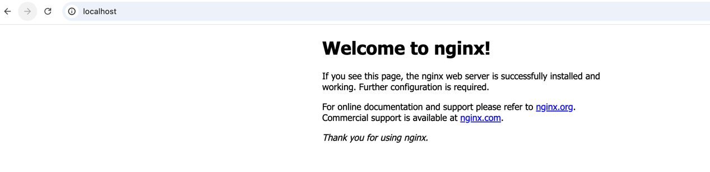

해당 파일 실행 명령어
```kubectl apply -f nginx-pod.yml```

쿠버네티스 파드 확인 명령어
```kubectl get pods```

POD 접속
```kubectl exec -it <POD-NAME> -- bash```

로컬 PC의 80 번 포트와 POD에 80번 포트를 포트 포워딩 하기위해 설정
```sudo kubectl port-forward pod/<POD-NAME> 80:80```


POD 삭제
```kubectl delete pod <POD-NAME>```
